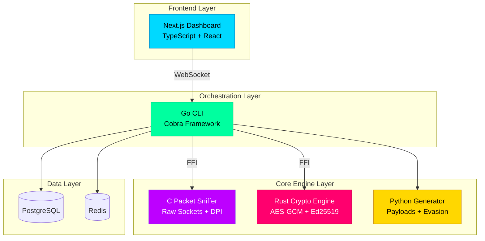

<div align="center">

# 🛡️ RedNet

### Multi-Language Cybersecurity Toolkit

*A production-ready security framework showcasing advanced systems programming, modern cryptography, and full-stack development across 6 languages*

[](https://opensource.org/licenses/MIT)
[](https://www.docker.com/)
[]()
[](CONTRIBUTING.md)
[](https://github.com/Quantum-Fiend/RedNet/stargazers)

[Features](#-features) • [Quick Start](#-quick-start) • [Architecture](#-architecture) • [Demo](#-demo) • [Documentation](#-documentation)


</div>

---

## 🎯 Overview

**RedNet** is a comprehensive cybersecurity framework that demonstrates **expert-level proficiency** across multiple programming paradigms. Built with a focus on **security, performance, and scalability**, it combines low-level systems programming with modern web technologies.

### Why RedNet?

- 🔐 **Production-Ready Security Tools** - Real-world packet capture, encryption, and threat simulation
- 🚀 **Multi-Language Architecture** - Seamless integration of C, Rust, Go, Python, TypeScript, and JavaScript
- 🎨 **Modern UI/UX** - Beautiful glassmorphism design with real-time monitoring
- 🐳 **Docker-First** - Complete containerization with one-command deployment
- 📚 **Comprehensive Documentation** - 2,500+ lines of guides, tutorials, and API docs

---

## ✨ Features

<table>
<tr>
<td width="50%">

### 🔍 C Packet Sniffer
- **Raw Socket Capture** with zero-copy ring buffers
- **Deep Packet Inspection** (DPI) engine
- **Protocol Parsers** for TCP/UDP/ICMP/HTTP/DNS
- **PCAP Export** for Wireshark analysis
- **Cross-Platform** (Windows/Linux)

### 🔐 Rust Encryption Engine
- **AEAD Ciphers**: AES-256-GCM, ChaCha20-Poly1305
- **Digital Signatures**: Ed25519 (Curve25519)
- **Key Exchange**: X25519 Diffie-Hellman
- **KDF**: HKDF, PBKDF2, Argon2id
- **Hashing**: BLAKE3 (faster than SHA-256)
- **Memory Safety**: Zeroize-protected keys

### 🛠️ Go Cross-Platform CLI
- **Unified Interface** with 6 commands
- **FFI Integration** with C and Rust
- **Concurrent Processing** using goroutines
- **WebSocket Agents** for remote control
- **Cross-Compilation** for all platforms

</td>
<td width="50%">

### 🐍 Python Payload Generator
- **Benign Test Payloads** for security training
- **Encoding**: XOR, Base64, polymorphic
- **Evasion**: VM/debugger detection
- **Automation**: Red-team workflows
- **CLI Interface** with Click

### 🌐 TypeScript Web Dashboard
- **Next.js 14** with App Router
- **Real-Time Charts** (Recharts)
- **Glassmorphism UI** with neon accents
- **WebSocket Streaming** for live updates
- **JWT Authentication** & RBAC
- **Agent Management** interface

### 🐳 Docker Infrastructure
- **8 Microservices** orchestrated
- **PostgreSQL** for persistence
- **Redis** for caching
- **Multi-Stage Builds** optimized
- **One-Command Deploy**

</td>
</tr>
</table>

---

## 🏗️ Architecture



### Technology Stack

| Component | Technologies |
|-----------|-------------|
| **Packet Capture** | C, Raw Sockets, libpcap, Ring Buffers |
| **Cryptography** | Rust, AES-GCM, ChaCha20, Ed25519, X25519, BLAKE3, Argon2 |
| **CLI** | Go, Cobra, CGO, Goroutines, WebSockets |
| **Payloads** | Python, Click, PyCryptodome |
| **Frontend** | TypeScript, Next.js 14, React 18, Tailwind CSS, Recharts |
| **Backend** | Node.js, Express, Socket.IO, JWT |
| **Infrastructure** | Docker, PostgreSQL, Redis |

---

## 🚀 Quick Start

### Prerequisites

- **Docker** 20.10+ and **Docker Compose** 2.0+
- 8GB RAM minimum
- 20GB free disk space

### Installation

```bash
# Clone the repository
git clone https://github.com/Quantum-Fiend/RedNet.git
cd RedNet

# Start all services
docker-compose up -d

# Verify services are running
docker-compose ps
```

### Access the Dashboard

Open your browser to **http://localhost:3000**

**Default Credentials:**
- Username: `admin`
- Password: `admin123`

### Using the CLI

```bash
# Enter the CLI container
docker-compose exec go-cli sh

# Capture packets
rednet capture -i eth0 -c 100 -o capture.pcap

# Encrypt a file
rednet encrypt -i secret.txt -o secret.enc -a aes-gcm

# Generate test payload
rednet-payload generate -t benign_test -o test.bin
```

---

## 📸 Screenshots

<div align="center">

### Dashboard Overview


### Network Telemetry


### Agent Management


</div>

---

## 🎬 Demo

### 15-Minute Walkthrough

```bash
# 1. Start the system
docker-compose up -d

# 2. Encrypt a file
docker-compose exec go-cli sh
echo "Secret Data" > /tmp/secret.txt
rednet encrypt -i /tmp/secret.txt -o /tmp/secret.enc

# 3. Generate payload
docker-compose exec python-payload sh
rednet-payload generate -t benign_test -o /tmp/test.bin
rednet-payload detect  # Run sandbox detection

# 4. View dashboard
# Open http://localhost:3000 in browser
```

See [DEMO.md](DEMO.md) for a complete demonstration script.

---

## 📚 Documentation

| Document | Description |
|----------|-------------|
| [Quick Start Guide](QUICKSTART.md) | Installation and basic usage |
| [Demo Script](DEMO.md) | 15-minute walkthrough |
| [Contributing](CONTRIBUTING.md) | How to contribute |
| [Security Policy](SECURITY.md) | Security guidelines |
| [Changelog](CHANGELOG.md) | Version history |
| [Project Summary](PROJECT_SUMMARY.md) | Executive overview |

---

## 🎓 Learning Outcomes

This project demonstrates:

### Systems Programming
- ✅ Raw socket programming in C
- ✅ Memory-safe systems code in Rust
- ✅ Concurrent programming in Go
- ✅ Cross-language FFI integration

### Cryptography
- ✅ Modern AEAD ciphers (AES-GCM, ChaCha20-Poly1305)
- ✅ Elliptic curve cryptography (Ed25519, X25519)
- ✅ Secure key derivation (Argon2id, HKDF)
- ✅ High-performance hashing (BLAKE3)

### Network Security
- ✅ Packet capture and analysis
- ✅ Deep packet inspection
- ✅ Protocol parsing
- ✅ Traffic filtering

### Full-Stack Development
- ✅ Modern React with Next.js 14
- ✅ Real-time WebSocket communication
- ✅ RESTful API design
- ✅ JWT authentication

### DevOps
- ✅ Docker containerization
- ✅ Multi-service orchestration
- ✅ Database integration
- ✅ Automated deployment

---

## 🛡️ Security

> [!WARNING]
> **This toolkit is designed for authorized security testing and educational purposes only.**

- ✅ Use only in controlled, authorized environments
- ✅ Obtain explicit permission before testing systems
- ✅ Comply with all applicable laws and regulations
- ✅ Follow responsible disclosure practices

See [SECURITY.md](SECURITY.md) for detailed security policies.

---

## 🤝 Contributing

We welcome contributions! Please see [CONTRIBUTING.md](CONTRIBUTING.md) for guidelines.

### Quick Contribution Guide

1. Fork the repository
2. Create a feature branch (`git checkout -b feature/amazing-feature`)
3. Commit your changes (`git commit -m 'Add amazing feature'`)
4. Push to the branch (`git push origin feature/amazing-feature`)
5. Open a Pull Request

---

## 📊 Project Stats


---

## 🌟 Use Cases

- **Security Operations Centers (SOC)** - Network monitoring and threat detection
- **Red/Blue Team Exercises** - Security testing and training
- **Network Forensics** - Packet analysis and investigation
- **Education** - Learning cybersecurity concepts
- **Research** - Security research platform

---

## 🏆 Acknowledgments

- Inspired by real-world SOC tooling and security frameworks
- Built to showcase multi-language systems programming expertise
- Designed for cybersecurity professionals and enthusiasts

---

## 📄 License

This project is licensed under the **MIT License** - see the [LICENSE](LICENSE) file for details.

---

## 📧 Contact

**Project Maintainer**: RedNet Security Team  
**Email**: security@rednet.dev  
**Issues**: [GitHub Issues](https://github.com/yourusername/RedNet/issues)  
**Discussions**: [GitHub Discussions](https://github.com/yourusername/RedNet/discussions)

---

<div align="center">

### ⭐ Star this repository if you find it useful!

**Made with ❤️ for the cybersecurity community By Tushar Singh Bisht**

[⬆ Back to Top](#-rednet)

</div>
